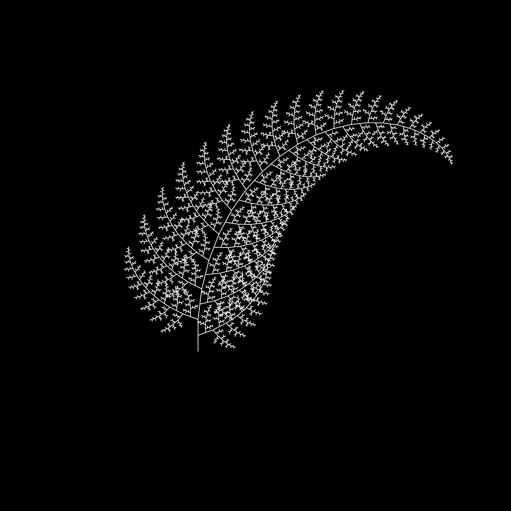

Tortuga - a Logo implementation in OCaml
-----------------------------------------------------------------

Tortuga is an implementation of the Logo programming language in OCaml.  It aims
to support the language as specified by the
[Berkley Logo](http://www.cs.berkeley.edu/~bh/v2ch14/manual.html).  It is
distributed under the MIT license.  It is currently under development but it is
already functional for simple examples (see below).

Contact: Nicolás Ojeda Bär `<n.oje.bar@gmail.com>`.

## Installation

<!-- Lg can be installed with `opam`: -->

<!--     opam install lg -->

<!-- If you don't use `opam` consult the [`opam`](opam) file for build instructions. -->

Tortuga allows for different graphical backends. The most basic one is provided
by OCaml's Graphics module, but it is quite poor. A better option is to use
[Vg](https://github.com/dbuenzli/vg) to produce beautiful PDF files. (A
javascript-based backend to see the pictures in a web browser is in the works.)

    opam install uutf otfm gg vg ounit pa_ounit
    cd ~/tmp
    git clone https://github.com/nojb/tortuga
    cd tortuga
    make

Now you can run `tortu.byte` to start the interpreter.

## Example

### The Fern

Type the following in a fresh session of the interpreter:

    to fern :size :sign
      if :size < 1 [ stop ]
      fd :size
      rt 70 * :sign fern :size * 0.5 :sign * -1 lt 70 * :sign
      fd :size
      lt 70 * :sign fern :size * 0.5 :sign rt 70 * :sign
      rt 7 * :sign fern :size - 1 :sign lt 7 * :sign
      bk :size * 2
    end
    clearscreen pu bk 150 lt 90 fd 90 rt 90 pd
    fern 25 1 render

The last command, `render`, produces the actual `pdf` file.  Don't forget to call
`render` if you want to see your images!

### Output

